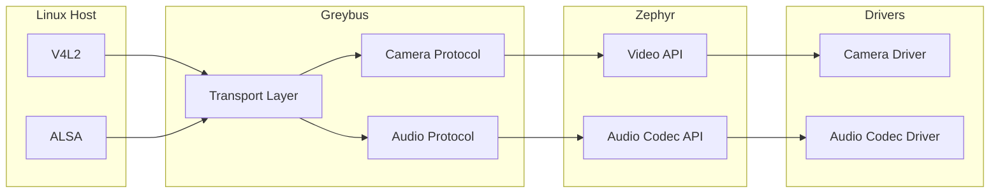
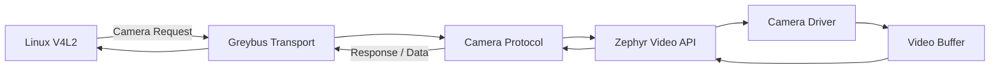
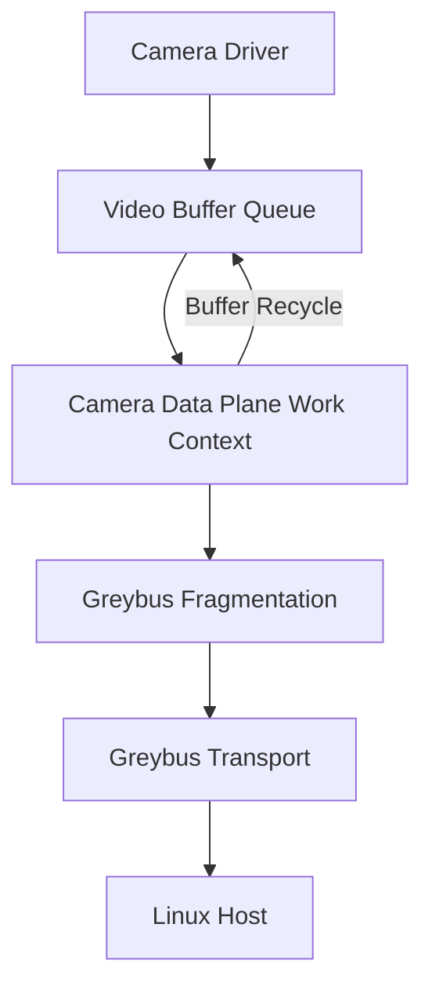
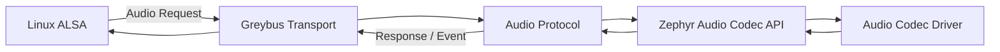
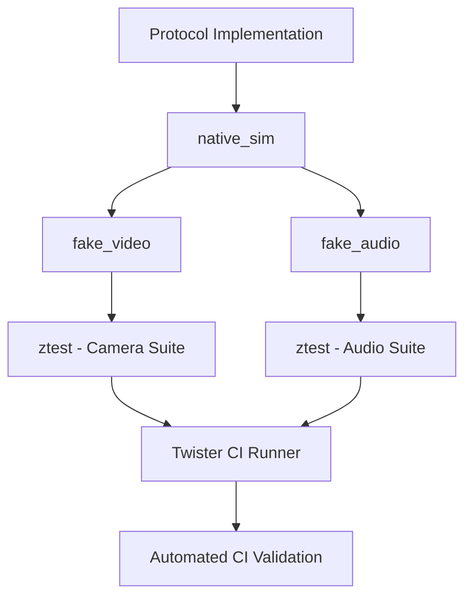

# Implementing Greybus Camera and Audio Protocols in Zephyr

> **Google Summer of Code 2026**  
> **Organization:** The Linux Foundation

> **Contributor:** Pavithra C.P.  
> **Mentors:** Ayush Singh, Jason Kidner

---

| | |
|---|---|
| **Subsystem** | Greybus |
| **Protocols** | Camera, Audio |
| **Language** | C |
| **Development Model** | Upstream First |
| **Target Platform** | Zephyr RTOS |
| **Validation** | `native_sim`, `ztest`, Twister |

---

## Overview

This repository documents the implementation of the Greybus Camera and Audio protocols in Zephyr developed for BeagleBoard during Google Summer of Code 2026 under The Linux Foundation.

Greybus provides a standardized protocol for connecting Linux hosts with embedded peripherals. While the Greybus transport layer already existed in Zephyr, multimedia support remained incomplete.

This project extends the subsystem by implementing the missing Camera and Audio protocols, bridging Linux multimedia interfaces (V4L2 and ALSA) with Zephyr's native Video and Audio Codec APIs.

The implementation emphasizes:

- Upstream maintainability
- Hardware abstraction
- Deterministic memory management
- Hardware-independent validation
- Incremental upstream integration

---

## System Architecture

The Greybus multimedia subsystem acts as a translation layer between Linux multimedia frameworks and Zephyr device drivers.

Incoming Greybus requests are translated into native Zephyr driver operations while keeping transport logic independent of hardware implementations. This separation enables protocol validation using simulated drivers before deployment on physical hardware.

---

## Deliverables

The following table summarizes the primary deliverables produced during the project.

| Component | Status |
|-----------|:------:|
| Greybus Camera Protocol | ✅ |
| Greybus Audio Protocol | ✅ |
| Fake Camera Driver | ✅ |
| Fake Audio Codec Driver | ✅ |
| `ztest` Validation | ✅ |
| `native_sim` Support | ✅ |
| Documentation | ✅ |
| Hardware procurement | ✅ |
| Hardware Testing Completely |  |

A detailed list of upstream pull requests and implementation milestones is provided in the **Pull Requests & Deliverables** section.

---

## Upstream Contributions- Pull Requests and Deliverables

The project followed an incremental upstream development model, with functionality introduced through focused pull requests rather than a single monolithic submission. This reduced review complexity, encouraged early maintainer feedback, and aligned with Zephyr's contribution workflow.

All the PRs are linked [here](https://github.com/beagleboard/greybus-zephyr/pulls?q=is%3Apr+is%3Aclosed+author%3ACPPavithra).

### Project at a Glance
 
GSOC 
| Metric | Value |
|---------|------:|
| **Merged Pull Requests** | **14** |
| **Commits** | **36** |
| **Lines Added** | **+2259** |
| **Lines Removed** | **-2199** |

Pre-GSOC (PWM Support and GPIO & Loopback Tests)
| Metric | Value |
|---------|------:|
| **Merged Pull Requests** | **3** |
| **Commits** | **3** |
| **Lines Added** | **+388** |
| **Lines Removed** | **-49** |

---

### Camera Subsystem

The Camera protocol formed the foundation of the project and therefore evolved through multiple focused pull requests. Early contributions established the subsystem architecture, while subsequent reviews refined implementation details and aligned the codebase with upstream expectations.

This iterative review process helped shape the development workflow used throughout the remainder of the project.
| Pull Request | Status | What it Delivered |
|---|:---:|---|
| **[#105](https://github.com/beagleboard/greybus-zephyr/pull/105)** - Drivers: Camera: Add virtual camera driver for `native_sim` | ✅ Merged | Added `fake_camera.c`, a hardware-independent virtual camera for Zephyr’s Video subsystem on `native_sim`. Implemented streaming, buffer enqueue/dequeue, format handling, `k_fifo` buffer management, and `k_timer`-based 10 FPS frame simulation. Added proper Kconfig/CMake integration and migrated testing to a `ztest` suite. |
| **[#108](https://github.com/beagleboard/greybus-zephyr/pull/108)** - camera: modernize handlers and migrate to `gb_message` API | ✅ Merged | Modernized the Greybus Camera handlers and migrated operation handling from the legacy `gb_operation` API to the newer `gb_message` transport. |
| **[#111](https://github.com/beagleboard/greybus-zephyr/pull/111)** - greybus: camera: streaming operations with Zephyr Video API | 🔄 Superseded | Initial implementation of Greybus Camera streaming operations using Zephyr’s Video API. Later refactored and split into smaller PRs following upstream review. |
| **[#112](https://github.com/beagleboard/greybus-zephyr/pull/112)** - greybus: camera: implement dynamic stream configuration and capture handlers | ✅ Merged | Implemented dynamic stream configuration and capture handling, connecting Greybus Camera requests with Zephyr’s Video subsystem and enabling frame capture through the protocol. |
| **[#117](https://github.com/beagleboard/greybus-zephyr/pull/117)** - Camera data plane architecture MVP | ✅ Merged | Implemented the initial camera data-plane architecture for transferring captured frames over Greybus. Added buffer management, frame fragmentation, and buffer recycling using a static, heap-free design. |
| **[#119](https://github.com/beagleboard/greybus-zephyr/pull/119)** - subsys: camera: migrate to new `video_driver_flush` API | ✅ Merged | Updated the camera subsystem to use Zephyr’s new `video_driver_flush` API, keeping the Greybus Camera implementation compatible with the modernized Video subsystem. |

---

### Audio Subsystem

Development of the Audio protocol benefited directly from the review feedback and architectural lessons learned during the Camera implementation.

As a result, the Audio subsystem required fewer pull requests while introducing substantially more functionality per contribution.

A test-driven workflow was adopted throughout development: each protocol operation was implemented together with its corresponding `ztest` validation before progressing to the next feature. This ensured that every functional addition was immediately covered by automated tests and helped keep the Continuous Integration pipeline green throughout development.

| Pull Request | Status | What it Delivered |
|---|:---:|---|
| **[#120](https://github.com/beagleboard/greybus-zephyr/pull/120)** - audio: Implement Greybus Audio Teardown, Events, and Power Management | ✅ Merged | Completed the Greybus Audio control path by implementing stream teardown, event handling, and power-management operations. This completed the key lifecycle operations required for managing Greybus Audio streams. |
| **[#118](https://github.com/beagleboard/greybus-zephyr/pull/118)** - subsys: greybus: Add audio protocol support and ztest integration | ✅ Merged | Added Greybus Audio protocol support with `ztest` integration for hardware-independent validation. Introduced automated tests for the implemented audio protocol handlers and their interaction with the Zephyr audio subsystem. |
| **[#116](https://github.com/beagleboard/greybus-zephyr/pull/116)** - audio: audio driver for mvp | ✅ Merged | Introduced the initial Audio driver MVP, providing the foundation for Greybus Audio stream handling and protocol-level testing within Zephyr. |

---
### Additional / Supporting Contributions

| Pull Request | Status | What it Delivered |
|---|:---:|---|
| **[#106](https://github.com/beagleboard/greybus-zephyr/pull/106)** — Update `beagleconnect_freedom` board targets | ✅ Merged | Updated the BeagleConnect Freedom board targets to keep the project aligned with the current Zephyr board definitions and build infrastructure. |
| **[#107](https://github.com/beagleboard/greybus-zephyr/pull/107)** — subsys: greybus: migrate to `TLS_CREDENTIAL_PUBLIC_CERTIFICATE` | ❌ Closed | Attempted to migrate Greybus TLS credential handling to Zephyr's newer `TLS_CREDENTIAL_PUBLIC_CERTIFICATE` API. The work was ultimately closed rather than merged and integrated with a different PR as it was just a 1 line change. |
| **[#94](https://github.com/beagleboard/greybus-zephyr/pull/94)** — pwm: add dynamic multi-channel support via devicetree | ✅ Merged | Added dynamic multi-channel PWM support using Zephyr Devicetree configuration, enabling PWM channels to be described and configured without hard-coded channel definitions. |
| **[#90](https://github.com/beagleboard/greybus-zephyr/pull/90)** — Introduced new test suite for PWM protocol — basic test | ✅ Merged | Added a dedicated ztest-based test suite for the Greybus PWM protocol, establishing automated validation for basic PWM operations. |
| **[#78](github.com/beagleboard/greybus-zephyr/pull/78)** — tests: loopback & gpio: add edge-case and boundary validation | ✅ Merged | Expanded Greybus Loopback and GPIO testing with edge-case and boundary-condition validation, improving protocol robustness and regression coverage. |

### Development Timeline

| Milestone | Outcome |
|---|---|
| **Foundation & Testing** | Established the development environment, expanded Greybus protocol test coverage, and introduced the virtual Camera driver for `native_sim` to enable hardware-independent development and validation. |
| **Camera Infrastructure** | Modernized the Greybus Camera subsystem and migrated protocol handling to the `gb_message` API, establishing the foundation for Camera protocol implementation using Zephyr's Video subsystem. |
| **Camera Features & Data Plane** | Implemented dynamic stream configuration, capture and streaming operations, followed by the Camera data plane for frame transfer, buffer management, fragmentation, and recycling. |
| **Camera Completion & API Alignment** | Completed the Camera protocol implementation and migrated the subsystem to Zephyr's new `video_driver_flush` API, bringing the implementation in line with upstream Video subsystem changes. |
| **Audio Driver & Core Protocol** | Introduced the Audio driver MVP and implemented the core Greybus Audio operations, including PCM configuration and control handling, establishing the foundation for the Audio protocol. |
| **Dynamic Audio Topology** | Implemented `GET_TOPOLOGY_SIZE` and `GET_TOPOLOGY`, dynamically constructing and transmitting a compliant ALSA topology containing DAIs, Controls, and Widgets. Added statically allocated, aligned buffers for predictable RTOS memory usage. |
| **Audio Stream Activation** | Implemented `ACTIVATE_TX` and `ACTIVATE_RX` with Greybus Audio state-machine validation, ensuring streams can only be activated after successful PCM configuration. Added comprehensive `native_sim` `ztest` coverage for the activation flow. |
| **Audio Data & Event Handling** | Extended the Audio implementation to support PCM data transfer and interrupt/event handling, enabling the protocol to progress beyond configuration into actual stream operation. |
| **Audio Lifecycle & Power Management** | Completed the remaining Audio lifecycle operations, including stream teardown, event handling, and power-management support, bringing the Greybus Audio implementation to a complete protocol lifecycle. |
| **Hardware Validation** |⏳ Ongoing-  Began hardware-level validation of the implemented Greybus functionality using the BeagleConnect Freedom and BeaglePlay, moving beyond `native_sim` testing to validate the protocol stack and communication on physical hardware. |
| **Validation & Upstream Integration** | Integrated the implemented Camera and Audio functionality with Zephyr's testing infrastructure, validated protocol behavior through hardware-independent tests, and upstreamed the completed changes through reviewed and merged PRs. |

---

### Development Approach

The implementation workflow evolved over the course of the project.

During the Camera implementation, protocol functionality was intentionally divided across multiple focused pull requests. This enabled architectural feedback to be incorporated early, reduced review complexity, and established a solid foundation for the multimedia subsystem.

By the time development transitioned to the Audio protocol, the architecture and upstream workflow had stabilized. Development therefore shifted to a feature-complete, test-driven approach where each protocol operation was implemented alongside its corresponding `ztest` validation in the same commit before progressing to the next operation.

This iterative workflow resulted in smaller review cycles, consistently passing CI, and a significantly smoother upstream review process.

---

## Engineering Decisions

Several architectural decisions shaped the implementation throughout the project. Rather than optimizing solely for feature completeness, the focus was on producing maintainable, upstream-quality code that integrates naturally with the existing Zephyr ecosystem.

### Hardware-Independent Development

Protocol correctness and hardware correctness are fundamentally different engineering problems.

To isolate protocol behavior from hardware-specific issues, development began entirely within Zephyr's `native_sim` environment using virtual Camera and Audio drivers. This enabled protocol routing, message parsing, and state transitions to be validated in software before introducing physical hardware into the development cycle.

As a result, most protocol issues were resolved long before deployment on BeaglePlay hardware, significantly reducing debugging complexity.

### 1. Upstream-First Design

Whenever existing Zephyr APIs evolved during development, the implementation was updated to follow the new interfaces rather than maintaining compatibility layers.

Examples include:

- Migration from the legacy `gb_operation` interface to the newer `gb_message` API.
- Adoption of the `video_driver_flush` API after its introduction upstream.

Keeping the implementation aligned with current upstream APIs reduced technical debt and ensured long-term maintainability.

### 2. Deterministic Memory Management

Multimedia streaming introduces sustained data movement, making predictable memory behavior important for embedded systems.

Protocol buffers and temporary objects therefore avoid dynamic heap allocation wherever practical, relying instead on static allocation and Zephyr kernel primitives such as `k_mem_slab`.

This design minimizes fragmentation while providing deterministic allocation behavior during protocol execution.

### 3. Test-Driven Feature Development

Development of the Audio subsystem followed a test-driven workflow.

Each protocol operation was implemented together with its corresponding `ztest` validation before moving to the next feature. Every logical feature therefore entered the repository together with automated regression tests, helping keep the Continuous Integration pipeline green throughout development.

This approach significantly reduced integration issues compared to validating functionality after implementation.

### 4. Incremental Upstreaming

The Camera subsystem was intentionally developed through multiple focused pull requests.

Early review feedback helped refine subsystem architecture, coding style, and API usage before additional functionality was introduced.

The lessons learned during Camera development directly influenced the Audio implementation, allowing substantially more functionality to be delivered through fewer pull requests while requiring significantly fewer review iterations.

Rather than simply reducing the number of PRs, the goal was to continuously improve the development workflow as the project matured.

## Protocol Implementations

The project implements two Greybus multimedia protocols within Zephyr: **Camera** and **Audio**. Both follow the same architectural pattern: Greybus requests are decoded at the protocol layer, translated into native Zephyr subsystem operations, and validated against hardware-independent drivers.

### Camera Protocol

The Greybus Camera implementation bridges Linux camera operations with Zephyr's Video API.

#### Request Flow

#### Protocol Operations

The Camera implementation covers the core stream lifecycle:

| **Operation** | **Purpose** |
|---|---|
| **Capability Discovery** | Exposes supported formats, resolutions, and stream capabilities to the host. |
| **Stream Configuration** | Translates host configuration into Zephyr Video API parameters. |
| **Capture** | Initiates frame capture and coordinates buffer processing. |
| **Flush** | Terminates outstanding stream operations and returns queued buffers. |

#### Capability Translation

Greybus Camera capabilities use protocol-specific representations, while Zephyr exposes capabilities through its native Video API. A translation layer was introduced to convert between the two representations without coupling the Greybus protocol directly to a particular camera driver.

This includes the dynamic translation of supported pixel formats and Extended CSI (ExtCSI) metadata.

#### Streaming Data Plane

The Camera data plane was designed separately from the control path. Video buffers are managed through Zephyr's buffer and queueing primitives, while a dedicated work context handles dequeuing, fragmentation, transport, and buffer recycling.

The resulting design keeps buffer management independent from Greybus message handling and avoids blocking the protocol handler while video data is being processed.

#### Camera Driver for `native_sim`

A virtual camera driver, `fake_video`, was introduced to exercise the Camera protocol without requiring physical camera hardware.

The driver implements the required Zephyr Video API operations and provides deterministic frame generation for protocol and integration testing.

This allows stream configuration, capture, queueing, flushing, and error paths to be validated entirely within the Zephyr test environment.

---

### Audio Protocol

The Greybus Audio implementation bridges Linux ALSA operations with Zephyr's Audio Codec API.

#### Request Flow

#### Protocol Operations

The Audio implementation provides the core control and topology operations required to expose an embedded audio device through Greybus.

| **Operation** | **Purpose** |
|---|---|
| **PCM Configuration** | Configures audio stream parameters requested by the host. |
| **Topology** | Represents codec components and their relationships to the host. |
| **Activation** | Enables configured audio paths and streams. |
| **Widget Control** | Enables or disables individual audio components (DAPM). |
| **Stream Teardown** | Releases active stream state and associated resources. |
| **Jack / Button Events** | Reports asynchronous hardware events to the host. |

#### Topology Translation

The Audio protocol requires the embedded codec topology to be represented using Greybus-specific structures.

The implementation dynamically translates Zephyr audio properties and codec components into the corresponding Greybus topology representation. This keeps the Greybus representation independent of the underlying codec implementation while allowing different Zephyr audio drivers to use the same protocol layer.

#### Asynchronous Events

Audio events such as jack insertion/removal and button activity originate independently of host requests.

The protocol supports asynchronous, IRQ-safe event handling for `JACK_EVENT` and `BUTTON_EVENT`. This decouples hardware-generated events from synchronous Greybus requests and allows the protocol layer to proactively notify the Linux host when codec state changes.

---

## Validation & Testing

Both protocols were designed to be validated independently of physical multimedia hardware.

The test environment combines Zephyr's `native_sim` platform, virtual drivers, `ztest`, and the Twister test runner.

A virtual camera driver (`fake_video`) and a virtual codec (`fake_audio`) were introduced to exercise the protocols without requiring physical hardware. They expose the expected Zephyr APIs and provide deterministic data generation.
This allows stream configuration, capture, topology generation, widget control, and error paths—including simulated `-ENOMSG` transport failures—to be validated entirely within the Zephyr CI test environment before introducing physical hardware into the development cycle.

## Results & Project Impact

The project delivered the missing Greybus Camera and Audio protocol implementations while extending Zephyr's multimedia infrastructure with hardware-independent validation.

| Area | Result |
|---|---|
| **Protocols** | Greybus Camera and Greybus Audio implemented |
| **Virtual Drivers** | `fake_video` and `fake_audio` added for simulation |
| **Automated Testing** | `ztest` suites integrated with Twister |
| **Hardware Independence** | Protocol behavior validated through `native_sim` |
| **Upstream Integration** | Implementation developed through focused, reviewable pull requests |
| **API Modernization** | Legacy Video and Audio API integration (previously nutanix code) migrated to current Zephyr interfaces |
| **Memory Management** | Protocol execution designed around deterministic allocation |
| **Legacy Code** | Significant legacy Camera and Audio code removed while expanding functionality |

The resulting implementation provides a reusable foundation for Greybus multimedia support in Zephyr while keeping protocol logic independent from individual hardware drivers.

---

## Future Work

The current implementation establishes the software foundation for Greybus multimedia support. Further work can extend validation and protocol coverage across additional hardware and use cases.

- **Physical Hardware Validation** — Validate Camera and Audio data paths on BeaglePlay and BeagleConnect hardware.
- **Protocol Expansion** — Extend Greybus multimedia support to additional operations and device capabilities.
- **Upstream Refinement** — Incorporate further maintainer feedback and continue aligning the implementation with evolving Zephyr APIs.

---

## Acknowledgements

This project was completed as part of **Google Summer of Code 2026** with **The Linux Foundation** and **BeagleBoard.org Foundation**.

Many thanks to my mentors, **Ayush Singh** and **Jason Kidner**, for their technical guidance, architectural feedback, and continued support throughout the project.

Thanks to the Linux Foundation, BeagleBoard.org and Zephyr communities for maintaining the open-source infrastructure that made this work possible, and to the Google Summer of Code program for providing the opportunity to contribute to a production-grade embedded ecosystem.

---

## Resources

| Resource | Link |
|---|---|
| **GSoC 2026 Proposal** | [Project Proposal](https://docs.google.com/document/d/1sTkjRjtG-BepgoTwk_uiY9mMByCsaJcvwooTdJe_mnY/edit?usp=sharing) |
| **Weekly Progress Reports** (Not fully updated yet) | [GSoC Weekly Progress Thread](https://forum.beagleboard.org/t/weekly-progress-report-implement-missing-greybus-protocols-in-zephyr/43993/15) |
| **Greybus Zephyr Repository** | [beagleboard/greybus-zephyr](https://github.com/beagleboard/greybus-zephyr) |
| **BeagleBoard.org Foundation** | [beagleboard.org](https://www.beagleboard.org/) |
| **Zephyr Project** | [zephyrproject.org](https://www.zephyrproject.org/) |
| **Detailed Final Report** (Not ready yet) | [Full Technical Report](#) |

> **Note:** The detailed final report contains the deeper implementation history, design trade-offs, debugging process, and challenges encountered throughout the project. This README intentionally focuses on the architecture, implementation, validation strategy, and upstream contributions.

---

## Project Repository

The complete implementation and upstream contribution history are available in the Greybus Zephyr repository.

**[View the Greybus Zephyr Repository →](https://github.com/beagleboard/greybus-zephyr)**

---

*Google Summer of Code 2026 · The Linux Foundation · BeagleBoard.org Foundation · Zephyr Project*
