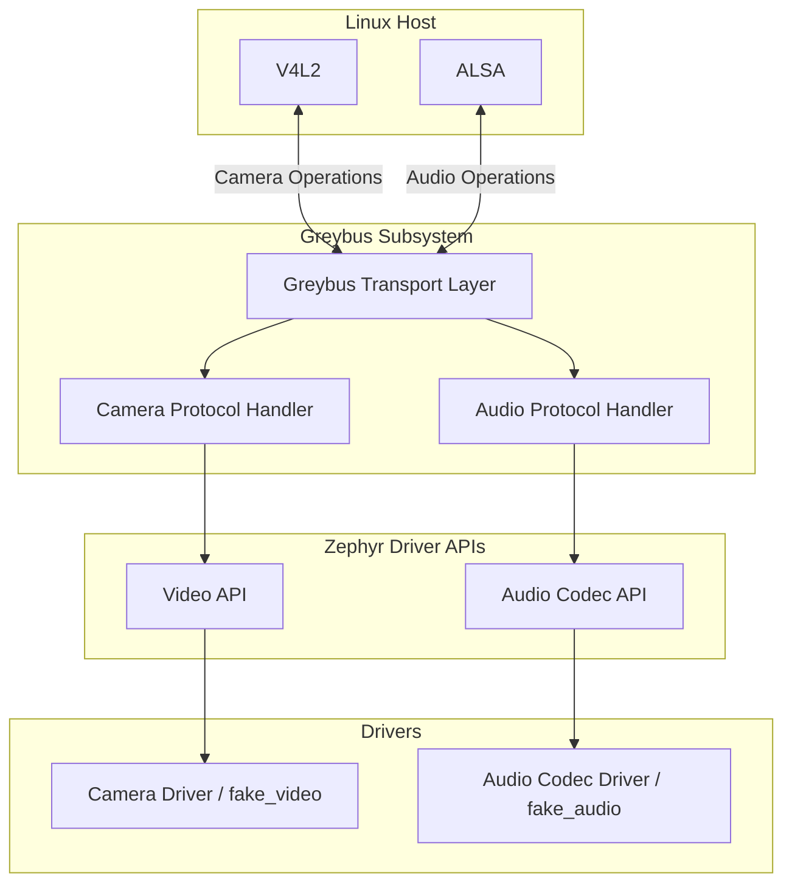
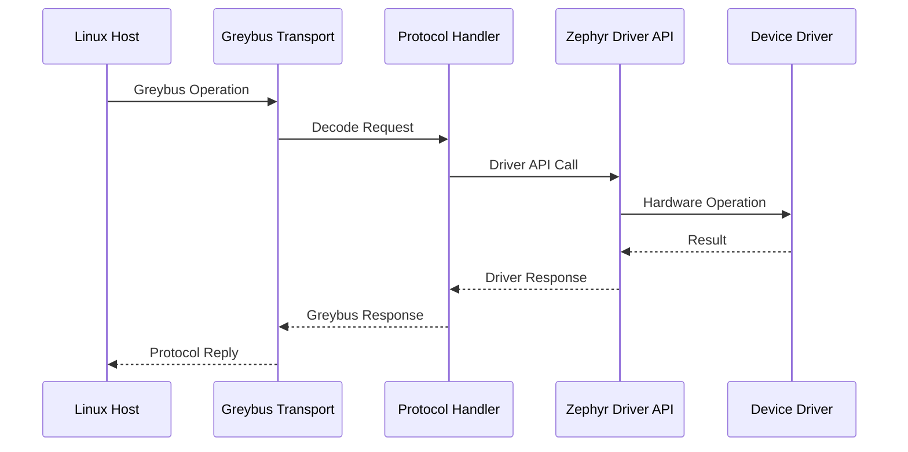
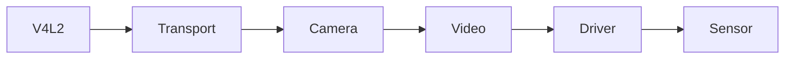
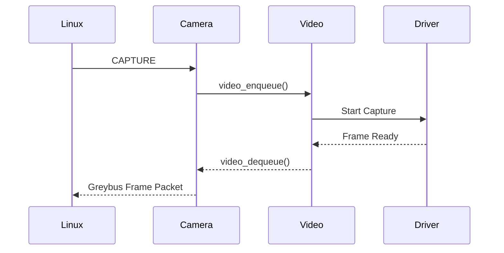
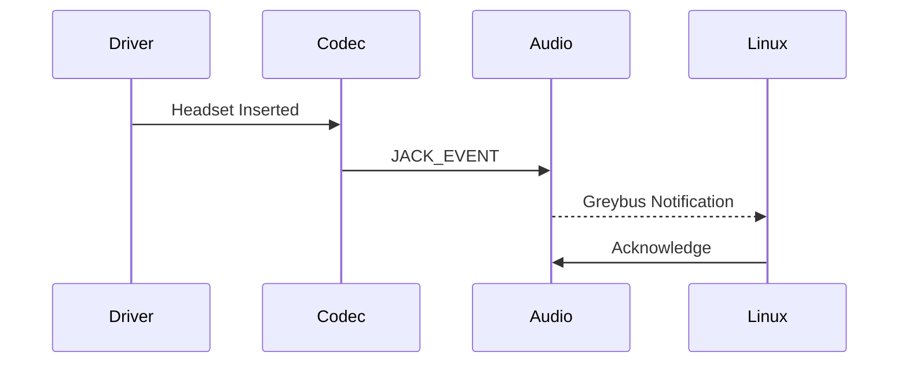

# Implementing Missing Greybus Multimedia Protocols in Zephyr

> **Google Summer of Code 2026**  
> **Organization:** BeagleBoard.org Foundation / The Zephyr Project  
> **Contributor:** Pavithra C.P.  
> **Mentors:** Ayush Singh, Jason Kridner

---

## Overview

This repository documents the implementation, architecture, and validation of the Greybus Camera and Audio protocols added to Zephyr during Google Summer of Code 2026.

Greybus sits between the Linux multimedia stack and Zephyr device drivers. Incoming protocol messages are translated into native driver operations, allowing Linux applications to interact with embedded peripherals through a standardized, transport-independent interface.

Prior to this work, Zephyr lacked upstream implementations of the Greybus Camera and Audio protocols, limiting multimedia support for Greybus peripherals. The implementation bridges Linux multimedia interfaces (V4L2 and ALSA) with Zephyr's native Video and Audio Codec APIs, enabling hardware such as the BeaglePlay to route multimedia streams between Linux hosts and Zephyr-based peripherals.

The project was developed with an upstream-first philosophy, emphasizing maintainability, deterministic behavior, hardware-independent validation, and incremental upstream integration.

---

## Scope

| Component | Status |
|-----------|:------:|
| Greybus Camera Protocol | ✅ Complete |
| Greybus Audio Protocol | ✅ Complete |
| Fake Camera Driver | ✅ Complete |
| Fake Audio Codec Driver | ✅ Complete |
| `ztest` Validation | ✅ Complete |
| `native_sim` Integration | ✅ Complete |
| Physical Hardware Validation | 🔄 In Progress |

---

## Project Statistics

| Metric | Value |
|---------|-------|
| Program | Google Summer of Code 2026 |
| Duration | 12 Weeks |
| Target RTOS | Zephyr |
| Programming Language | C |
| Protocols Implemented | 2 |
| Fake Drivers Added | 2 |
| Pull Requests | *(Update after final submission)* |
| Unit Tests | *(Update after final submission)* |
| Continuous Integration | Twister |
| Validation Platform | `native_sim` |

---

## Design Goals

The implementation was guided by the following architectural principles.

- Maintain compatibility with upstream Zephyr APIs.
- Separate protocol logic from hardware-specific drivers.
- Enable complete hardware-independent validation.
- Eliminate dynamic memory allocation during protocol execution.
- Minimize subsystem coupling.
- Maximize code reuse across protocol implementations.
- Support incremental upstream review through logically separated pull requests.

---

## System Overview

Greybus acts as a protocol translation layer between Linux multimedia frameworks and Zephyr device drivers.

Rather than exposing Zephyr drivers directly to Linux applications, Greybus defines a standardized transport-independent protocol for exchanging multimedia operations. Incoming protocol messages are decoded by protocol handlers and translated into native Zephyr driver API calls.

This layered architecture isolates transport logic from hardware drivers, simplifying testing, improving portability, and enabling complete protocol validation without requiring physical hardware.

---

## High-Level Architecture

### Software Stack

```text
                    Linux Applications
                            │
                            ▼
                     V4L2 / ALSA APIs
                            │
                            ▼
                 Greybus Transport Layer
                            │
                            ▼
             Camera / Audio Protocol Handlers
                            │
                            ▼
              Zephyr Driver Framework APIs
           (Video API / Audio Codec API)
                            │
                            ▼
              Device Drivers (Real or Fake)
                            │
                            ▼
             Hardware or native_sim Backend
```

### Component Architecture



The Greybus transport layer remains independent of the underlying device drivers. This separation allows protocol implementations to be validated entirely using simulated drivers while remaining compatible with physical hardware.

---

## Architectural Decisions

The implementation prioritizes upstream maintainability through modern Zephyr APIs, deterministic memory management, hardware-independent validation, and incremental upstream review.

### Deterministic Memory Management

Multimedia streaming requires predictable memory behavior and bounded allocation latency. Dynamic heap allocation introduces fragmentation and non-deterministic execution characteristics that are undesirable in embedded systems.

Protocol payloads and intermediate buffers therefore utilize static allocation together with Zephyr's `k_mem_slab` allocator to guarantee deterministic behavior throughout protocol execution.

---

### Hardware-Independent Validation

Protocol development was performed using Zephyr's `native_sim` platform before deployment on physical hardware.

By isolating protocol state machines from the underlying transport, unit tests are able to verify packet construction, protocol state transitions, and error handling without requiring I²C, I²S, CSI, or camera hardware.

This significantly reduces debugging complexity while enabling comprehensive automated validation within Continuous Integration.

---

### Incremental Upstream Integration

Large protocol implementations were intentionally divided into smaller logical pull requests.

This approach simplifies maintainer review, reduces regression risk, encourages early feedback, and improves long-term maintainability of the subsystem.

The Camera protocol work additionally modernized portions of the legacy Video API integration, resulting in a net reduction of legacy code while simultaneously expanding subsystem capabilities.

---

---

# Implementation

The multimedia subsystem is organized around a layered architecture that separates protocol transport, protocol logic, and hardware-specific drivers.

Both the Camera and Audio implementations reuse the same Greybus transport infrastructure while exposing protocol-specific functionality through dedicated handlers.

This organization minimizes subsystem coupling, enables protocol reuse, and allows independent validation of each layer.

---

# Shared Infrastructure

Although Camera and Audio expose different protocol operations, both implementations follow an identical execution model.

Incoming Greybus requests are decoded by the transport layer, dispatched to the appropriate protocol handler, translated into Zephyr driver API calls, and returned to the Linux host through the Greybus messaging interface.



This common execution path significantly reduces duplicated protocol logic while maintaining a consistent software architecture across multiple Greybus multimedia protocols.

---

# Camera Protocol

The Greybus Camera protocol provides a transport-independent interface between Linux V4L2 applications and Zephyr's Video subsystem.

Incoming Camera protocol operations are translated into native Video API calls while preserving protocol semantics defined by the Greybus specification.

## Protocol Architecture



---

## Implemented Operations

| Operation | Description |
|-----------|-------------|
| Version Negotiation | Reports supported protocol version |
| Capability Discovery | Enumerates camera capabilities |
| Configure Streams | Configures capture streams |
| Capture | Starts frame acquisition |
| Flush | Flushes queued buffers |
| Metadata Translation | Maps Zephyr capabilities to ExtCSI |

---

## Capability Translation

One of the primary responsibilities of the Camera protocol is translating Zephyr's internal Video API into Greybus ExtCSI capability descriptors.

The implementation performs translation of:

- Pixel formats
- Image resolutions
- Frame intervals
- Stream configuration
- Camera metadata

This abstraction allows Linux applications to discover peripheral capabilities without requiring knowledge of Zephyr's internal driver interfaces.

---

## Capture Pipeline

Frame capture follows the execution path shown below.



---

## Buffer Management

The Camera implementation avoids heap allocation during protocol execution.

Frame buffers are managed using statically allocated memory together with Zephyr synchronization primitives.

Design goals include:

- Deterministic allocation latency
- Zero heap fragmentation
- Predictable execution
- Safe concurrent access

---

# Audio Protocol

The Greybus Audio protocol bridges Linux ALSA operations with Zephyr's Audio Codec API.

Rather than implementing codec-specific logic, the protocol provides a generic abstraction layer capable of supporting multiple codecs through Zephyr's driver framework.

---

## Protocol Architecture

```mermaid
flowchart LR

ALSA

↓

Greybus Transport

↓

Audio Protocol

↓

Audio Codec API

↓

Codec Driver

↓

Hardware
```

---

## Implemented Operations

| Operation | Description |
|-----------|-------------|
| Version | Protocol negotiation |
| Set PCM | Configure PCM stream |
| Get Topology | Enumerate widgets and controls |
| Enable Widget | Power up DAPM component |
| Disable Widget | Power down DAPM component |
| Set Control | Configure mixer/control values |
| Get Control | Read mixer/control values |
| Activate TX | Enable transmit path |
| Activate RX | Enable receive path |
| Deactivate TX | Disable transmit |
| Deactivate RX | Disable receive |
| Jack Events | Notify headset insertion/removal |
| Button Events | Notify media button presses |

---

## Audio Topology

The implementation dynamically generates Greybus topology descriptors from Zephyr Audio Codec properties.

Rather than maintaining protocol-specific metadata, topology information is derived directly from codec capabilities exposed through the driver API.

This ensures protocol responses remain synchronized with the underlying hardware implementation.

---

## Event Flow



---

## Power Management

Audio widgets are managed using Greybus DAPM operations.

Widget activation and deactivation are translated into Zephyr Audio Codec API calls, allowing unused portions of the signal path to remain powered down until required.

This mirrors Linux ALSA's Dynamic Audio Power Management model while remaining compatible with Zephyr's driver abstractions.

---

# Fake Drivers

Two reusable fake drivers were developed to enable protocol validation independent of physical hardware.

| Driver | Purpose |
|---------|----------|
| fake_video | Camera protocol validation |
| fake_audio | Audio protocol validation |

The fake drivers expose deterministic behavior that allows protocol handlers to be exercised through automated tests without requiring camera sensors or codec hardware.

This significantly improves testing repeatability and Continuous Integration coverage.

---

# Implementation Summary

The multimedia subsystem consists of reusable transport infrastructure, protocol-specific handlers, hardware-independent fake drivers, and native Zephyr driver integrations.

This layered design enables protocol validation using `native_sim`, promotes code reuse across Greybus protocols, and simplifies future expansion of the multimedia subsystem.
