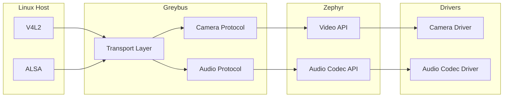

# Implementing Missing Greybus Multimedia Protocols in Zephyr

> **Google Summer of Code 2026**  
> **Organization:** BeagleBoard.org Foundation / The Zephyr Project  
> **Contributor:** Pavithra C.P.  
> **Mentors:** Ayush Singh, Jason Kridner

---

| | |
|---|---|
| **Subsystem** | Greybus |
| **Protocols** | Camera, Audio |
| **Language** | C |
| **Development Model** | Upstream First |
| **Target Platform** | Zephyr RTOS |
| **Validation** | `native_sim`, `ztest`, Twister |

---

## Overview

This repository documents the implementation of the Greybus Camera and Audio protocols developed for Zephyr during Google Summer of Code 2026.

Greybus provides a standardized protocol for connecting Linux hosts with embedded peripherals. While the Greybus transport layer already existed in Zephyr, multimedia support remained incomplete.

This project extends the subsystem by implementing the missing Camera and Audio protocols, bridging Linux multimedia interfaces (V4L2 and ALSA) with Zephyr's native Video and Audio Codec APIs.

The implementation emphasizes:

- Upstream maintainability
- Hardware abstraction
- Deterministic memory management
- Hardware-independent validation
- Incremental upstream integration

---

## System Architecture

The Greybus multimedia subsystem acts as a translation layer between Linux multimedia frameworks and Zephyr device drivers.

Incoming Greybus requests are translated into native Zephyr driver operations while keeping transport logic independent of hardware implementations. This separation enables protocol validation using simulated drivers before deployment on physical hardware.

---

## Deliverables

The following table summarizes the primary deliverables produced during the project.

| Component | Status |
|-----------|:------:|
| Greybus Camera Protocol | ✅ |
| Greybus Audio Protocol | ✅ |
| Fake Camera Driver | ✅ |
| Fake Audio Codec Driver | ✅ |
| `ztest` Validation | ✅ |
| `native_sim` Support | ✅ |
| Documentation | ✅ |

A detailed list of upstream pull requests and implementation milestones is provided in the **Pull Requests & Deliverables** section.

---

## Upstream Contributions

The project followed an incremental upstream development model, with functionality introduced through focused pull requests rather than a single monolithic submission. This reduced review complexity, encouraged early maintainer feedback, and aligned with Zephyr's contribution workflow.

### Project at a Glance

| Metric | Value |
|---------|------:|
| **Merged Pull Requests** | **X** |
| **Commits** | **XX** |
| **Files Changed** | **XX** |
| **Lines Added** | **+X,XXX** |
| **Lines Removed** | **-X,XXX** |

---

### Camera Subsystem

The Camera protocol formed the foundation of the project and therefore evolved through multiple focused pull requests. Early contributions established the subsystem architecture, while subsequent reviews refined implementation details and aligned the codebase with upstream expectations.

This iterative review process helped shape the development workflow used throughout the remainder of the project.

| Pull Request | Status | What it Delivered |
|---------------|:------:|-------------------|
| **#105** — Drivers: Camera: Add virtual camera driver for `native_sim` | ✅ Merged | *Update summary* |
| **#108** — camera: modernize handlers and migrate to `gb_message` API | ✅ Merged | *Update summary* |
| **#111** — greybus: camera: streaming operations with Zephyr Video API | 🔄 Superseded | Initial implementation that was later refactored and split following upstream review. |
| **#112** — greybus: camera: implement dynamic stream configuration and capture handlers | ✅ Merged | *Update summary* |
| **#117** — Camera data plane architecture MVP | ✅ Merged | *Update summary* |
| **#119** — subsys: camera: migrate to new `video_driver_flush` API | ✅ Merged | *Update summary* |

---

### Audio Subsystem

Development of the Audio protocol benefited directly from the review feedback and architectural lessons learned during the Camera implementation.

As a result, the Audio subsystem required fewer pull requests while introducing substantially more functionality per contribution.

A test-driven workflow was adopted throughout development: each protocol operation was implemented together with its corresponding `ztest` validation before progressing to the next feature. This ensured that every functional addition was immediately covered by automated tests and helped keep the Continuous Integration pipeline green throughout development.

| Pull Request | Status | What it Delivered |
|---------------|:------:|-------------------|
| **#116** — audio: audio driver for MVP | ✅ Merged | *Update summary* |
| **#118** — subsys: greybus: Add audio protocol support and `ztest` integration | ✅ Merged | *Update summary* |

---

### Development Timeline

| Milestone | Outcome |
|-----------|---------|
| **Foundation** | Established the development environment and introduced a virtual camera driver for `native_sim`. |
| **Camera Infrastructure** | Modernized the Camera subsystem and migrated to the `gb_message` API. |
| **Camera Features** | Added stream configuration, capture handlers, and the Camera data plane. |
| **Audio Protocol** | Implemented the Audio driver, Greybus Audio protocol, topology handling, and protocol validation. |
| **API Migration** | Updated the subsystem to use the latest `video_driver_flush` API following upstream changes. |

---

### Development Approach

The implementation workflow evolved over the course of the project.

During the Camera implementation, protocol functionality was intentionally divided across multiple focused pull requests. This enabled architectural feedback to be incorporated early, reduced review complexity, and established a solid foundation for the multimedia subsystem.

By the time development transitioned to the Audio protocol, the architecture and upstream workflow had stabilized. Development therefore shifted to a feature-complete, test-driven approach where each protocol operation was implemented alongside its corresponding `ztest` validation in the same commit before progressing to the next operation.

This iterative workflow resulted in smaller review cycles, consistently passing CI, and a significantly smoother upstream review process.
