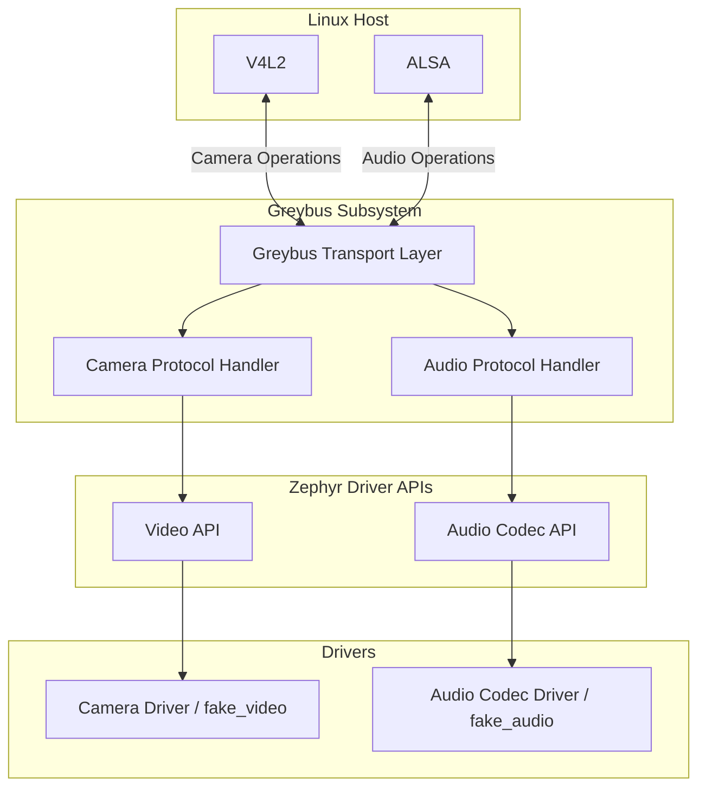

# Implementing Missing Greybus Multimedia Protocols in Zephyr

> **Google Summer of Code 2026**  
> **Organization:** BeagleBoard.org Foundation / The Zephyr Project  
> **Contributor:** Pavithra C.P.  
> **Mentors:** Ayush Singh, Jason Kridner

---

## Overview

This repository documents the implementation, architecture, and validation of the Greybus Camera and Audio protocols added to Zephyr during Google Summer of Code 2026.

Greybus sits between the Linux multimedia stack and Zephyr device drivers. Incoming protocol messages are translated into native driver operations, allowing Linux applications to interact with embedded peripherals through a standardized, transport-independent interface.

Prior to this work, Zephyr lacked upstream implementations of the Greybus Camera and Audio protocols, limiting multimedia support for Greybus peripherals. The implementation bridges Linux multimedia interfaces (V4L2 and ALSA) with Zephyr's native Video and Audio Codec APIs, enabling hardware such as the BeaglePlay to route multimedia streams between Linux hosts and Zephyr-based peripherals.

The project was developed with an upstream-first philosophy, emphasizing maintainability, deterministic behavior, hardware-independent validation, and incremental upstream integration.

---

## Scope

| Component | Status |
|-----------|:------:|
| Greybus Camera Protocol | ✅ Complete |
| Greybus Audio Protocol | ✅ Complete |
| Fake Camera Driver | ✅ Complete |
| Fake Audio Codec Driver | ✅ Complete |
| `ztest` Validation | ✅ Complete |
| `native_sim` Integration | ✅ Complete |
| Physical Hardware Validation | 🔄 In Progress |

---

## Project Statistics

| Metric | Value |
|---------|-------|
| Program | Google Summer of Code 2026 |
| Duration | 12 Weeks |
| Target RTOS | Zephyr |
| Programming Language | C |
| Protocols Implemented | 2 |
| Fake Drivers Added | 2 |
| Pull Requests | *(Update after final submission)* |
| Unit Tests | *(Update after final submission)* |
| Continuous Integration | Twister |
| Validation Platform | `native_sim` |

---

## Design Goals

The implementation was guided by the following architectural principles.

- Maintain compatibility with upstream Zephyr APIs.
- Separate protocol logic from hardware-specific drivers.
- Enable complete hardware-independent validation.
- Eliminate dynamic memory allocation during protocol execution.
- Minimize subsystem coupling.
- Maximize code reuse across protocol implementations.
- Support incremental upstream review through logically separated pull requests.

---

## System Overview

Greybus acts as a protocol translation layer between Linux multimedia frameworks and Zephyr device drivers.

Rather than exposing Zephyr drivers directly to Linux applications, Greybus defines a standardized transport-independent protocol for exchanging multimedia operations. Incoming protocol messages are decoded by protocol handlers and translated into native Zephyr driver API calls.

This layered architecture isolates transport logic from hardware drivers, simplifying testing, improving portability, and enabling complete protocol validation without requiring physical hardware.

---

## High-Level Architecture

### Software Stack

```text
                    Linux Applications
                            │
                            ▼
                     V4L2 / ALSA APIs
                            │
                            ▼
                 Greybus Transport Layer
                            │
                            ▼
             Camera / Audio Protocol Handlers
                            │
                            ▼
              Zephyr Driver Framework APIs
           (Video API / Audio Codec API)
                            │
                            ▼
              Device Drivers (Real or Fake)
                            │
                            ▼
             Hardware or native_sim Backend
```

### Component Architecture



The Greybus transport layer remains independent of the underlying device drivers. This separation allows protocol implementations to be validated entirely using simulated drivers while remaining compatible with physical hardware.

---

## Architectural Decisions

The implementation prioritizes upstream maintainability through modern Zephyr APIs, deterministic memory management, hardware-independent validation, and incremental upstream review.

### Deterministic Memory Management

Multimedia streaming requires predictable memory behavior and bounded allocation latency. Dynamic heap allocation introduces fragmentation and non-deterministic execution characteristics that are undesirable in embedded systems.

Protocol payloads and intermediate buffers therefore utilize static allocation together with Zephyr's `k_mem_slab` allocator to guarantee deterministic behavior throughout protocol execution.

---

### Hardware-Independent Validation

Protocol development was performed using Zephyr's `native_sim` platform before deployment on physical hardware.

By isolating protocol state machines from the underlying transport, unit tests are able to verify packet construction, protocol state transitions, and error handling without requiring I²C, I²S, CSI, or camera hardware.

This significantly reduces debugging complexity while enabling comprehensive automated validation within Continuous Integration.

---

### Incremental Upstream Integration

Large protocol implementations were intentionally divided into smaller logical pull requests.

This approach simplifies maintainer review, reduces regression risk, encourages early feedback, and improves long-term maintainability of the subsystem.

The Camera protocol work additionally modernized portions of the legacy Video API integration, resulting in a net reduction of legacy code while simultaneously expanding subsystem capabilities.

---

## Next Section

The following section provides a detailed implementation overview of the Greybus Camera and Audio protocols, including protocol architecture, request flow, subsystem interactions, validation methodology, and upstream pull requests.
